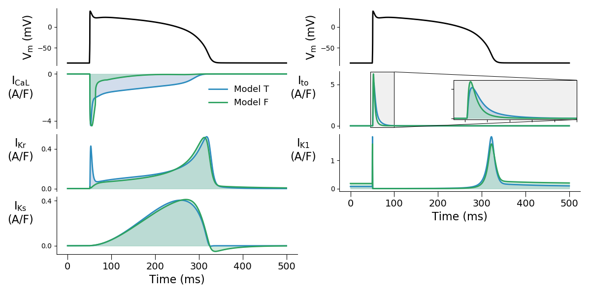

# Action potential model example

A typical method of fitting cardiac action potential models is by scaling/updating the maximum conductance parameters of an existing action potential model.
This method usually assumes that the underlying kinetics of each ion channel current within the candidate model are correct and perfect (i.e. they match perfectly to the ground truth).
Here, we explicitly impose that the underlying kinetics of each ion channel current are _imperfect_.
Then we will _ignore_ the discrepancy and proceed with our analysis with the incorrect assumption (i.e. without acknowledging model discrepancy).
Finally, we compare the prediction of those calibrated candidate models under our context of use (COU) to the ground truth (model).

### Models

- Model Fink 2008 (candidate model): Fink et al. 2008 model.
- Model TNNP 2004 (ground truth model): ten Tusscher et al. 2004 model.

The differences between the two models can be viewed by running `plot-differences.py`.

### Use of protocol

In this tutorial, we split our protocols into calibration and COU.
Note that here we do not have validation protocol, as to emphasise the importance of validation.

- Protocol `stim1hz`: calibration.
- Protocol `randstim`: calibration.
- Protocol `stim2hz`: COU prediction.
- Protocol `hergblock`: COU prediction.
- Protocol `current`: COU prediction.

### Arguments

- `[which_model]` can be one of `tnnp-2004-w`, `fink-2008`
- `[which_data]` and `[which_calibration]` can be one of `stim1hz`, `randstim`
- `[which_predict]` can be one of `stim1hz`, `randstim`, `stim2hz`, `hergblock`, `current`

## Run the tutorial

1. Run `generate-data.py` to generate synthetic data with iid Gaussian noise (create `data`).
2. Run `fit.py` with arguments `[which_model]` and `[which_data]` to calibrate the specified model with the specified (protocol) data from `./data`. Alternatively run `fit-all.sh`.
3. Run `predict.py` with arguments `[which_model]`, `[which_calibration]` and `[which_predict]` to predict the specified (protocol) data (in `./data`) with the specified model and calibrated model parameters (in `./out`). Alternatively run `predict-all.sh`.
4. Run `mcmc.py` with arguments `[which_model]` and `[which_data]` to run MCMC for the specified model with the specified (protocol) data from `./data`. Alternatively run `mcmc-all.sh`.
5. Run `posterior.py` with arguments `[which_model]`, `[which_calibration]` and `[which_predict]` to create posterior predictives for the specified (protocol) data (in `./data`) with the specified model and MCMC samples of the model parameters (in `./out`). Alternatively run `posterior-all.sh`.

### TODO

- For #2 above, maybe also try history matching type of method? But this probably will not make a difference.

### Output

- `out`: Fitting output etc.
- `fig`: Output generated figures.
- `data`: Data generated from the ground truth model.

### Utilities

- `method`: Contains all the useful methods/functions for this tutorial.
- `mmt-model-files`: Ion channel model in Myokit `mmt` format.

### Tests

- `test-models.py`: Simple test for default model setting and forward model simulations.
