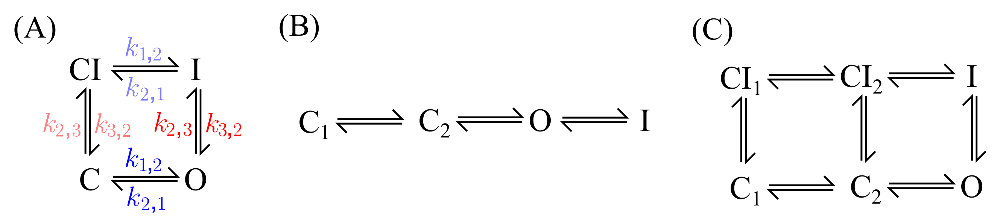

# Ion channel model tutorial

The ion channel that is used throughout this tutorial is the ion channel which carries the current IKr.

### Models

We are interested in selecting the model that 'best describe' the ground truth (model) from our two candidate models.

- Model A (candidate model): Beattie et al. 2018 model.
- Model B (candidate model): Oehmen et al. 2002 model.
- Model C (ground truth model): Di Veroli et al. 2013 model (temperature at 295K; parameters from fitting to Beattie et al. 2018 cell \#5 data).

### Use of protocol

In this tutorial, we split our protocols into calibration and validation uses.

- Protocol `sinewave`: calibration.
- Protocol `staircase`: validation.
- Protocol `ap`: validation.

### Arguments

- `[which_model]` can be one of `A`, `B`.
- `[which_predict]` can be one of `sinewave`, `staircase`, `AP`.

## Run the tutorial

Before calibration, run `generate-data.py` to generate synthetic data with i.i.d. Gaussian noise (create `data`).

### 1. Calibration with i.i.d. noise assumption
1. Run `fit.py` with argument `[which_model]` to calibrate the specified model. Alternatively run `fit-all.sh`.
2. Run `predict.py` with arguments `[which_model]` and `[which_predict]` to predict the specified (protocol) data (in `./data`) with the specified model and calibrated model parameters (in `./out`). Alternatively run `predict-all.sh`.
3. Run `compare.py` with argument `[which_predict]` to compare the predictions of the specified (protocol) data (in `./data`) from the candidate models with the calibrated model parameters (in `./out`). Alternatively run `compare-all.sh`.
4. Run `mcmc.py` with argument `[which_model]` to run MCMC for the specified model. Alternatively run `mcmc-all.sh`.

### 2. Calibration with discrepancy model: GP(t)
1. Run `fit-gp.py` with argument `[which_model]` to calibrate the specified model.
2. Run `mcmc-gp.py` with argument `[which_model]` to run MCMC for the specified model.

### 3. Calibration with discrepancy model: GP(O,V)
1. Run `fit-gp-ov.py` with argument `[which_model]` to calibrate the specified model.
2. Run `mcmc-gp-ov.py` with argument `[which_model]` to run MCMC for the specified model.

### 4. Calibration with discrepancy model: ARMA(p,q)
1. Run `mcmc-arma.py` with arguments `[which_model]`, `[arma_p]`, and `[arma_q]` to run MCMC for the specified model, where `[arma_p]` and `[arma_q]` are integers specifying the order of the AR and MA models, respectively.
We use ARMA(2,2) model throughout the paper.

### 5. Run posterior predictive
1. Run `posterior.py` with arguments `[which_model]` and `[which_predict]` to generate posterior predictive with i.i.d. noise assumption. Alternatively run `posterior.sh`.
2. Run `posterior-gp.py` with arguments `[which_model]` and `[which_predict]` to generate posterior predictive with GP(t) discrepancy model. Alternatively run `posterior-gp.sh`.
3. Run `posterior-gp-ov.py` with arguments `[which_model]` and `[which_predict]`, together with a `-ov` flag, to generate posterior predictive with GP(O,V) discrepancy model. Alternatively run `posterior-gp-ov.sh`.
4. Run `posterior-gp-ov.py` with arguments `[which_model]`, `[arma_p]`, and `[arma_q]` to generate posterior predictive with ARMA(p,q) discrepancy model. Alternatively run `posterior-arma.sh`.

Alternatively, run `posterior-all.sh` to generate all the posterior predictive for all models in one go.

### 6. Plot final figures (comparison)
1. Run `compare-posteriors.py` with argument `[which_model]` to plot the marginal posterior distributions for the specified model, for all discrepancy models. Alternatively run `compare-posteriors.sh`.
2. Run `compare-pp.py` with arguments `[which_model]` and `[which_predict]` to plot the posterior predictive for the specified model and protocol/data, for all discrepancy models. Alternatively run `compare-pp.sh`.
3. Run `compare-evidence.py` with argument `[which_model]` to generate a table (in PDF/PNG format) showing the marginal likelihood of the specified model, for all discrepancy models and protocols/data.
4. Run `compare-error-mean.py` with argument `[which_model]` to generate a table (in PDF/PNG format) showing the error mean of the specified model, for all discrepancy models and protocols/data.
5. Run `compare-mean-error.py` with argument `[which_model]` to generate a table (in PDF/PNG format) showing the mean error of the specified model, for all discrepancy models and protocols/data.

Alternatively, run `compare-tables.sh` to generate all the tables (Steps 3-5) in one go.

### Output

- `out`: Fitting output etc.
- `fig`: Output generated figures.
- `data`: Data generated from the ground truth model.

### Utilities

- `method`: Contains all the useful methods/functions for this tutorial.
- `mmt-model-files`: Ion channel models in Myokit `mmt` format.
- `protocol-time-series`: Voltage clamp protocols in `csv`, time-series format. Each file has two columns, the first one is time (in [seconds]) and the second column is voltage (in [milliVolts]).

### Tests

- `test-models.py`: Simple test for default model setting and forward model simulations.

### Others
- `fit-gp-v.py`, `mcmc-gp-v.py`: Run calibration with GP(V) discrepancy model, which is not shown in the paper.
- `fit-gp-tv.py`, `mcmc-gp-tv.py`, `posterior-gp-tv.py`: Run calibration and posterior predictive with GP(t,V) discrepancy model, which is not shown in the paper.
- `mcmc-arma-invertible.py`: Run calibration with ARMA(p,q) discrepancy model and the invertibility condition, which is not shown in the paper.
